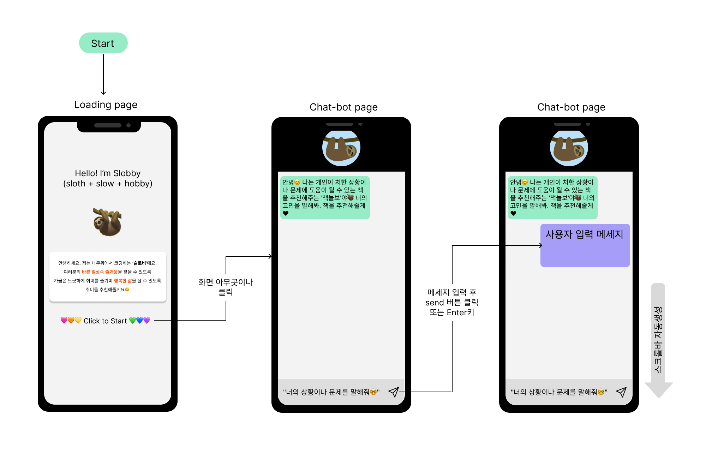

# 취미추천봇 슬로비 프로젝트 
- Chat GPT 서버 API를 연동하여 간단한 인공지능 챗봇을 구현함

## 1. 소개 및 목표
### 프로젝트 이름
- 🦥취미추천봇 슬로비🦥
- 슬로비(Slobby) : 개발자의 별명인 나무늘보 'sloth' + 바쁘지만 잠깐 쉬어가도 괜찮다는 뜻의 'slow' + 취미 'hobby'의 합성어

### 목표
- 취미추천봇 슬로비는 사용자 성향 또는 관심사에 맞는 취미를 추천하여 사용자의 삶을 즐겁고 행복하게 만드는 것

## 2. 프로젝트 개요
### 프로젝트 배경
- 슬로비 개발자가 취미를 찾지 못하는 고질적인 문제에서부터 시작
- 사용자들이 바쁜 일상 속 즐거움을 찾을 수 있도록, 가끔은 느긋하게 취미를 즐기며 행복한 삶을 가질 수 있게 하고 싶었음

### 주요 기능
- 사용자와의 대화를 통해 맞춤형 취미 추천

## 3. 챗봇 시연
### 시연 영상(실제 사용자 입력 예시와 그에 따른 취미 추천 결과를 보여줌)
[슬로비(Slobby) 시연영상](https://www.youtube.com/watch?v=dQw4w9WgXcQ)

## 4. 기술 스택
### HTML/CSS/JS

## 5. 기능 및 특징
### 주요 기능
- 3가지 취미 추천, 추천한 이유 제공

### 특징
- 귀엽고 친근한 인터페이스
- 맞춤형 추천

## 6. 개발 과정
### WBS(Work Breakdown Structure)

### 와이어프레임 ([와이어프레임_피그마_링크](https://www.figma.com/design/BZ3aFx00ZzaHZgPrbfnH0D/%EC%8A%AC%EB%A1%9C%EB%B9%84-%EC%99%80%EC%9D%B4%EC%96%B4%ED%94%84%EB%A0%88%EC%9E%84?node-id=0-1&t=w8JKhWOoejuHsGoQ-1))

## 7. 느낀 점
### 개발 사이클을 알게 됨
- 본격적인 개발 전 마땅히 해야할 것들 (github repository, WBS, 와이어프레임 등)을 무시한 채 코딩을 시작함
- 발표하기 위해 사후에 자료를 만듦
- 다음 프로젝트는 단계별로 수행가능

### 나의 현 수준을 파악
- 실제로 개발하며 어떤 부분을 모르는지 확실히 드러남 -> 발전할 수 있는 기회

### 개발 중 직면한 문제와 해결 방법
- 책 추천 챗봇을 계획했으나, 존재하지 않는 책을 추천하는 문제 발생
- 문제해결을 위해 네이버 도서API 또는 국립중앙도서관 API를 연결해 실존하는 책인지 확인하는 작업 추가 필요
- 개인의 역량부족으로 완성하지 못할 것이라 판단함
- 프로젝트 주제를 도서추천봇에서 취미추천봇으로 변경함
